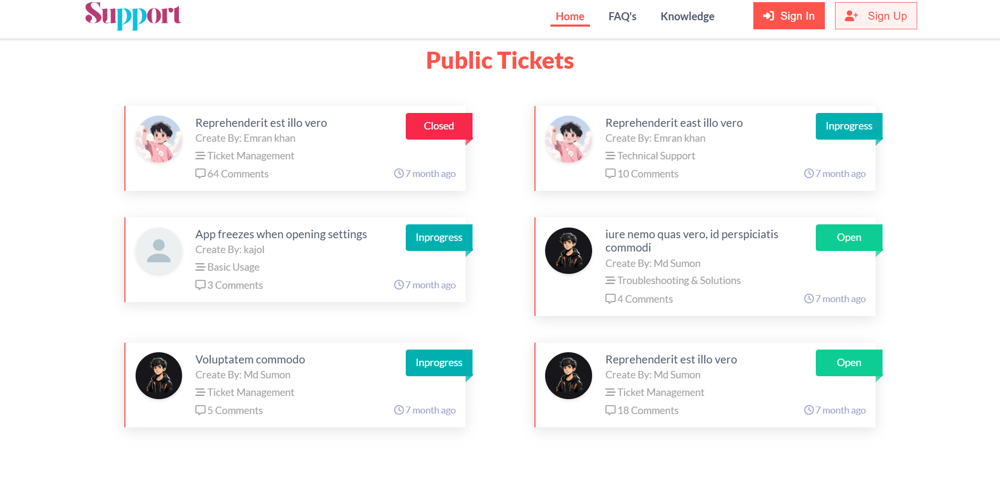
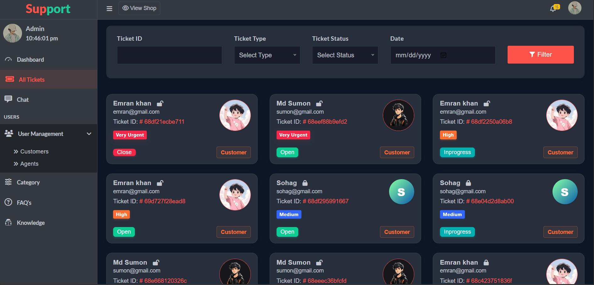
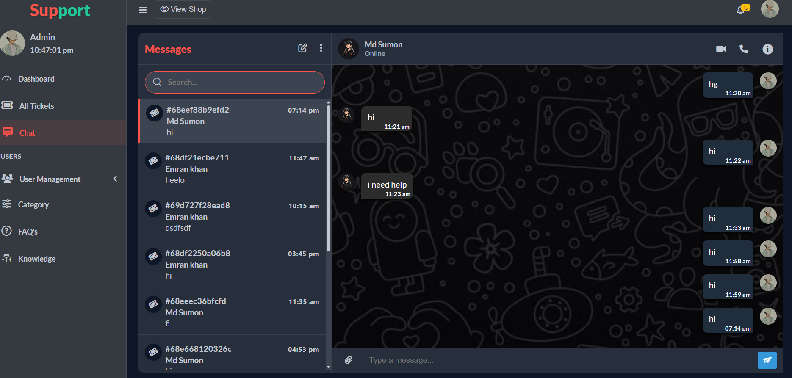
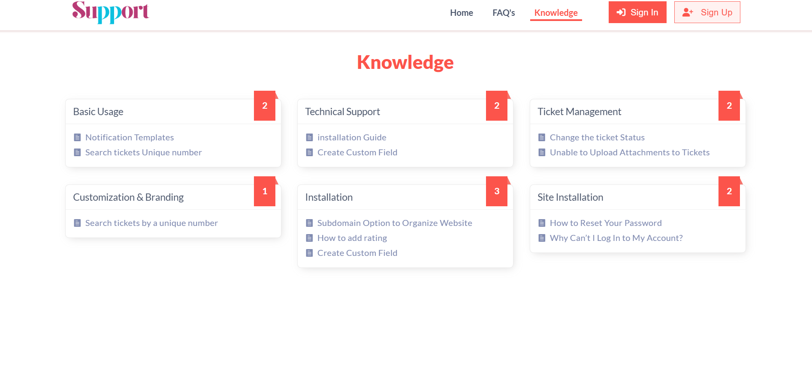
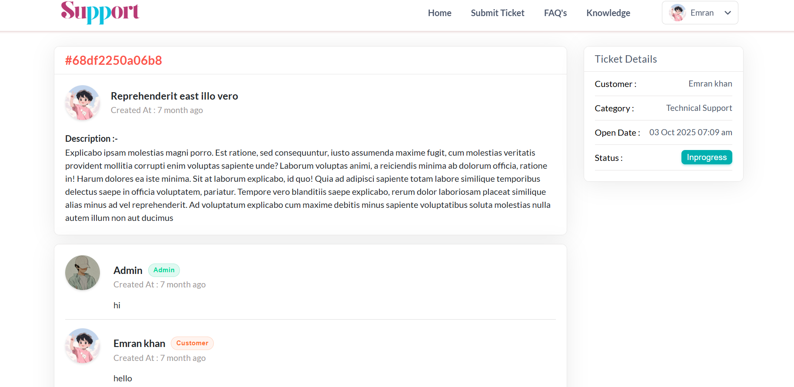
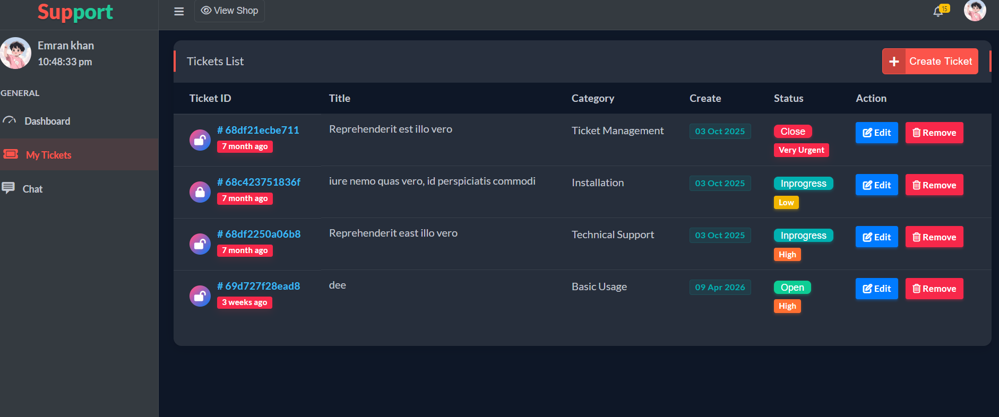

# 🛠 Support Ticket System

A modern Support Ticket Management System built with PHP CodeIgniter 3, Bootstrap 4, JavaScript, and jQuery, featuring real-time chat using Pusher for fast and efficient customer support communication.

### ✨ Features
- 👤 User, Agents & Admin dashboard
- 🎫 Create, manage, and track support tickets
- 💬 Real-time chat using Pusher
- 📊 Ticket status workflow (Open / Pending / Closed)
- 🔔 Instant message notifications
- 📱 Fully responsive UI (Bootstrap 4)
- 🔐 Secure authentication system

### 🧰 Tech Stack
- Backend: PHP (CodeIgniter 3)
- Frontend: Bootstrap 4, JavaScript, jQuery
- Real-time: Pusher
- Database: MySQL

### 📸 Screenshots

| Hero Area | Dashboard | Tickets | Chat | Knowledge | Create Ticket | Ticket Details |
|----------|--------|------|------|------|------|------|

### ⭐ Show Your Support

If you like this project, please ⭐ the repository.
